# Introducción a Google Cloud Run.

<style>
img[alt~="center"] {
  display: block;
  margin: 0 auto;
}
</style>

---

- Para desplegar aplicaciones dockerizadas tenemos varias opciones.
- Las más simples son:
    - Google Cloud Run en Google Cloud
    - Azure Container Instances
    - AWS Fargate
---
- Vamos a desplegar el API que acabamos de programar.
- Usaremos el código de la carpeta ejemplo_docker_3.

---

- El proceso que seguiremos se resume en:
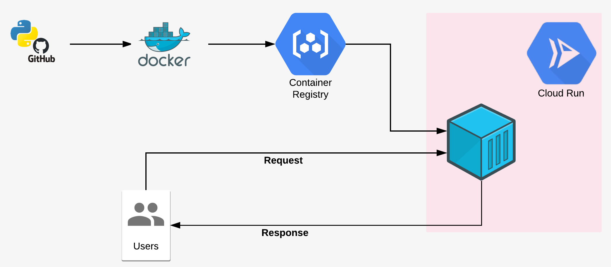

---
- Crearemos un nuevo repositorio en github.
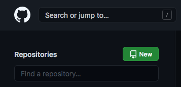
---
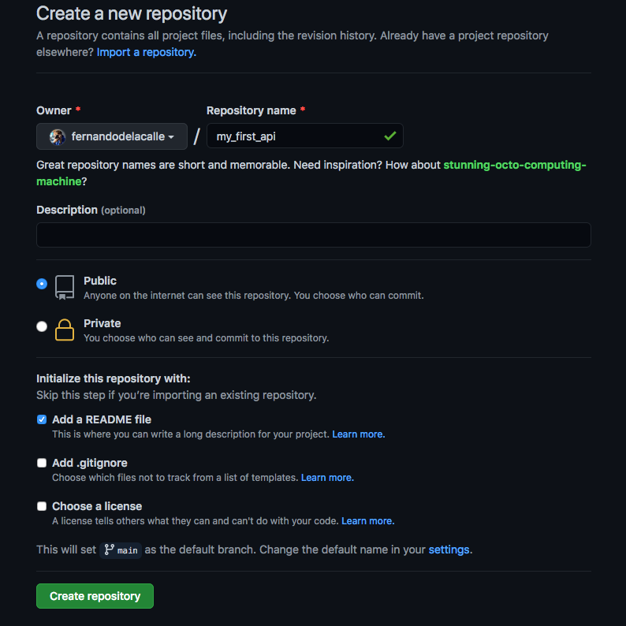

---
- En él pondremos todo el código de nuestra aplicación.
- Clona el repo desde gitkraken.
- Añade los ficheros de la carpeta ejemplo_docker_3..
---
- Haz un commit de los cambios y súbelo al repositorio de origen. 
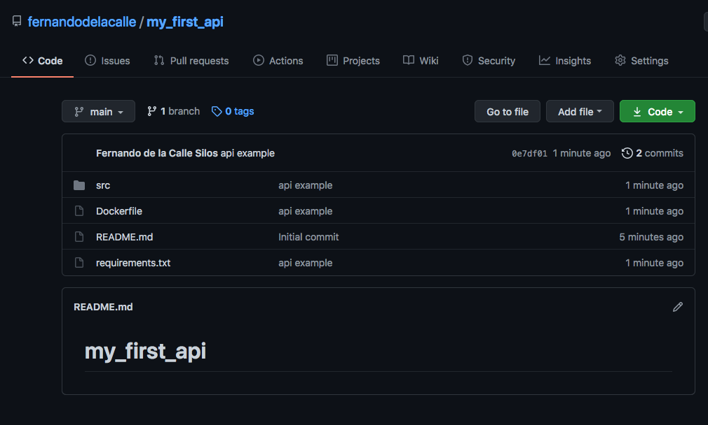
---

- Creamos un proyecto en google cloud
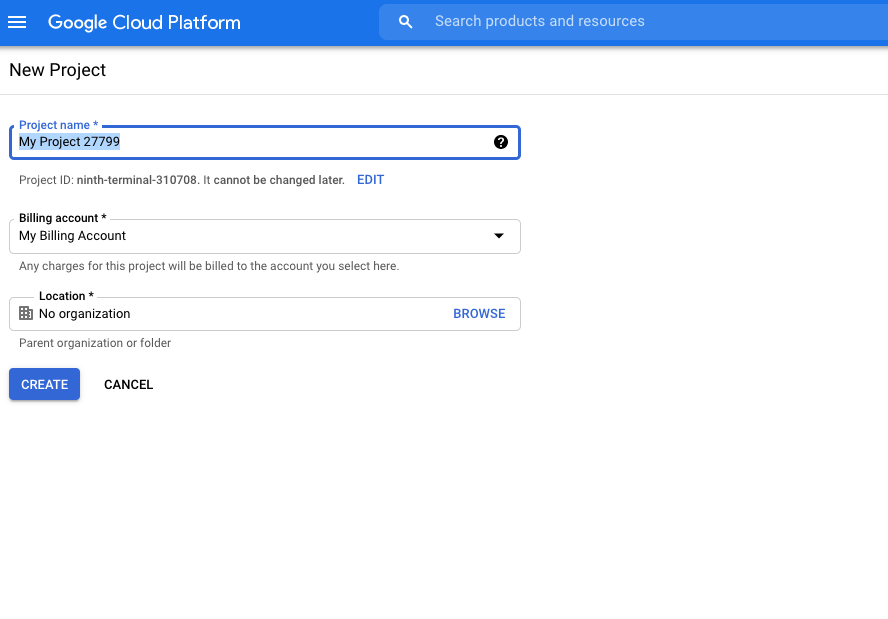

---
- Abrimos un cloud shell
- Comprobamos que el sheel está en proyecto que acabamos de crear.


---
- Clonamos el repo que acabamos de crear:
```bash
git clone https://github.com/----/my_first_api.git
cd my_first_api
```


---
- Tenemos que construir la imagen y subirla el registy de google.
- Para ello primero activamos el registry en nuestro proyecto

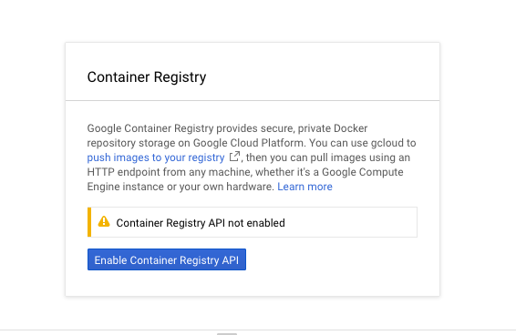

---

- El nombre de nuesta imagen será: gcr.io/PROJECT-ID/my-first-api
- Construimos la imagen con:
```bash
docker build -t gcr.io/PROJECT-ID/my-first-api .
```
- Podemos realizar una prueba ejecutando un contenedor con:
```bash
docker run  -p 8080:8080 gcr.io/PROJECT-ID/my-first-api
```
---
- Podemos ver si funciona usando web preview:
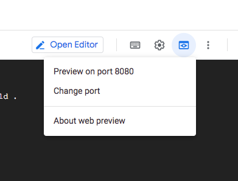

---


- Subimos la imagen al registy con:
```bash
docker push  gcr.io/PROJECT-ID/my-first-api
```
- Tendrás que ver en tu registy algo como esto:


---

- Ahora vamos a desplegar la imagen en cloud run.
- Para ello nos dirigimos en la interfaz a:


---

- Crearemos un nuevo servicio:
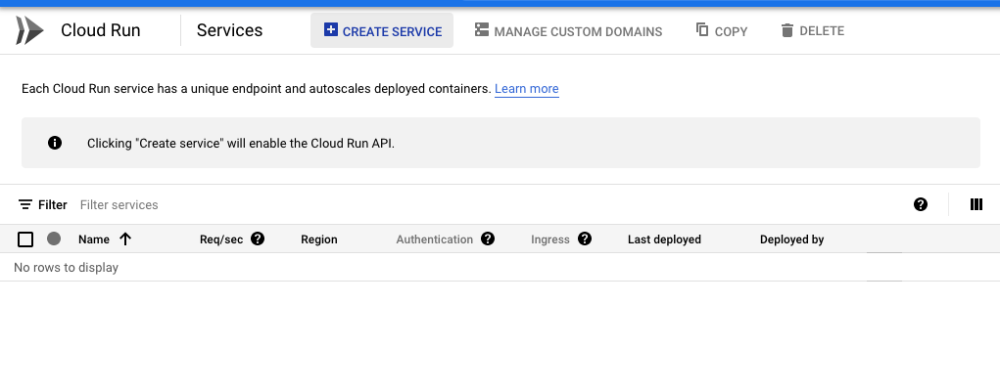
---
- Configuramos de la sigueinte manera:
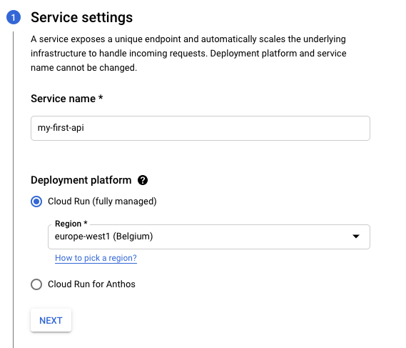

---
- Seleccionamos la imagen que acabamos de crear:
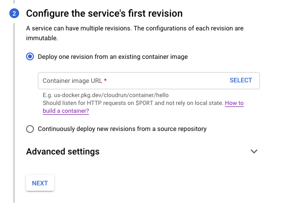

---
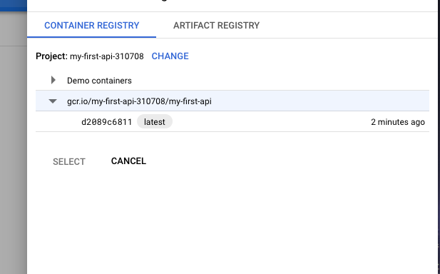

---

- Selecionamos por último las siguientes opciones:
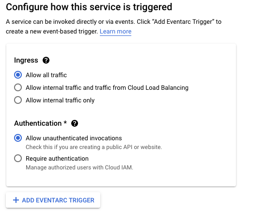

---
- Una vez deplegado veremos:
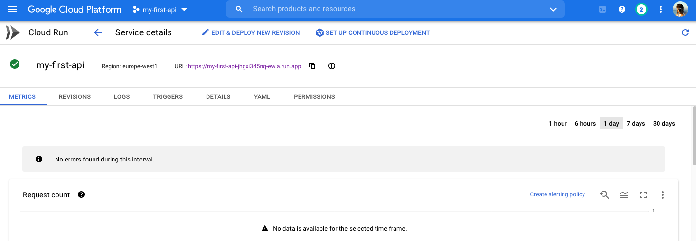
- Podemos ver nuestra API en la web url superior.
---


- Este proceso lo podemos realizar desde la linea de comandos con:
```bash
gcloud run deploy my-api --image gcr.io/PROJECT-ID/my-first-api:0.0.2 \
                                               --allow-unauthenticated \
                                               --platform managed \
                                               --region europe-west1 \
                                               --memory 2G \
```

---
- Si realizamos algún cambio es importante completar los tags para poder volver a versiones anteriores.
- Realicemos algún cambio en el código en nuestro ordenador.
- Subimos los cambios usando git kraken. 

---

- Desde el cloud shell:
    - Traemos los nuevos cambios:
    ```bash
    git pull origin main
    ```
    - Construimos la imagen:
    ```bash
    docker build -t gcr.io/my-first-api-310708/my-first-api:0.0.2 .
    ```
    - Subimos la imagen al registry:
    ```bash
    docker push  gcr.io/my-first-api-310708/my-first-api:0.0.2
    ```
    - Desplegamos desde línea de comandos:
    ```bash
    gcloud run deploy my-dash --image gcr.io/my-first-api-310708/my-first-api:0.0.2 \
                                                --allow-unauthenticated \
                                                --platform managed \
                                                --region europe-west1 \
                                                --memory 2G 
    ```
---

- Es interesante un producto llamado Cloud Scheduler que nos permite realizar invocaciones cron a nuestra API. Por ejemplo para la ejecucuón de algoritmos o ETLs.

---

# Ejercicio 
- Despliega tu aplicación dash. 
- Para ello realiza los siguientes pasos:
    - Usa el repo con el código de la app.
    - Desde la consola de google cloud:
        - Clona el repo.
        - Construye una nueva imagen y subela al registy.
        - Genera el nuevo servico en cloud run.
    - Comprueba que puedes acceder a la página web.

